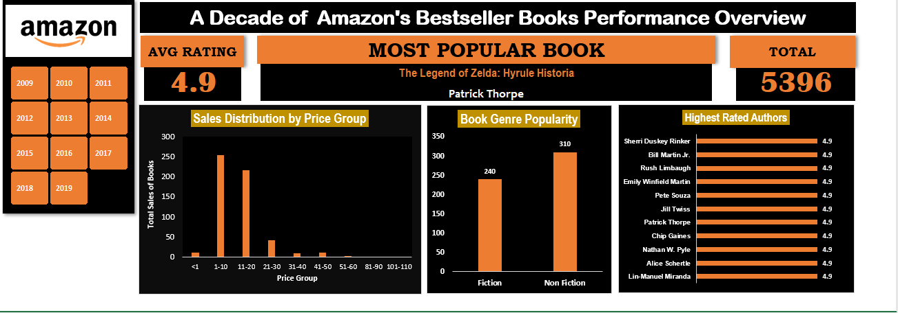

# Amazon Top 50 Best-Selling Books Dashboard (2009–2019)

This is an Excel dashboard analyzing the top 50 best-selling books on Amazon from 2009 to 2019.

🔎 Key Features:
Sales Distribution by Price Group: Visualizes how book sales vary across different price ranges.
Book Genre Popularity: Highlights the dominance of Fiction vs. Non-Fiction.
Highest Rated Authors: Showcases top-rated authors based on user ratings.

📚 KPIs:
Most Popular Book: Discover the standout title for each year.
Average Rating: Provides a snapshot of reader satisfaction.
Total Reviews: Evaluates book popularity by considering the number of ratings.
This dashboard offers actionable insights for publishers, authors, and book lovers alike.

📊 Built in Microsoft Excel

